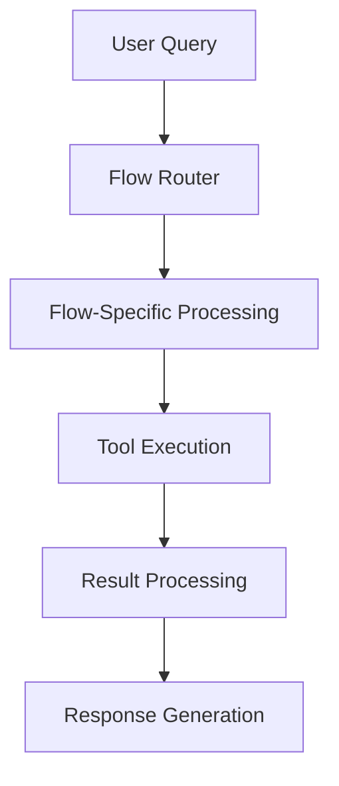

# Flows

This section contains documentation for the various research flows and state machines available in DeepCritical.

## Overview

DeepCritical organizes research workflows into specialized flows, each optimized for different types of research tasks and domains.

## Available Flows

### PRIME Flow
**Purpose**: Protein engineering and molecular design workflows
**Location**: [PRIME Flow Documentation](../user-guide/flows/prime.md)
**Key Features**:
- Scientific intent detection
- Adaptive replanning
- Domain-specific heuristics
- Tool validation and execution

### Bioinformatics Flow
**Purpose**: Multi-source biological data fusion and integrative reasoning
**Location**: [Bioinformatics Flow Documentation](../user-guide/flows/bioinformatics.md)
**Key Features**:
- Gene Ontology integration
- PubMed literature analysis
- Expression data processing
- Cross-database validation

### DeepSearch Flow
**Purpose**: Advanced web research with reflection and iterative strategies
**Location**: [DeepSearch Flow Documentation](../user-guide/flows/deepsearch.md)
**Key Features**:
- Multi-engine search integration
- Content quality filtering
- Iterative research refinement
- Result synthesis and ranking

### Challenge Flow
**Purpose**: Experimental workflows for benchmarks and systematic evaluation
**Location**: [Challenge Flow Documentation](../user-guide/flows/challenge.md)
**Key Features**:
- Method comparison frameworks
- Statistical analysis and testing
- Performance benchmarking
- Automated evaluation pipelines

### Code Execution Flow
**Purpose**: Intelligent code generation, execution, and automatic error correction
**Location**: [Code Execution Flow Documentation](../user-guide/flows/code-execution.md)
**Key Features**:
- Multi-language code generation
- Isolated execution environments
- Automatic error analysis and improvement
- Iterative error correction

## Flow Architecture

All flows follow a common architectural pattern:



### Common Components

#### State Management
Each flow uses Pydantic models for type-safe state management throughout the workflow execution.

#### Error Handling
Comprehensive error handling with recovery mechanisms, logging, and graceful degradation.

#### Tool Integration
Seamless integration with the DeepCritical tool registry for extensible functionality.

#### Configuration
Hydra-based configuration for flexible parameterization and environment-specific settings.

## Flow Selection

### Automatic Flow Selection
DeepCritical can automatically select appropriate flows based on query analysis and intent detection.

### Manual Flow Configuration
Users can explicitly specify which flows to use for specific research tasks:

```yaml
flows:
  prime:
    enabled: true
  bioinformatics:
    enabled: true
  code_execution:
    enabled: true
```

### Multi-Flow Coordination
Multiple flows can be combined for comprehensive research workflows that span different domains and methodologies.

## Flow Development

### Adding New Flows

1. **Create Flow Configuration**: Add flow-specific settings to `configs/statemachines/flows/`
2. **Implement Flow Logic**: Create flow-specific nodes and state machines
3. **Add Documentation**: Document the flow in `docs/user-guide/flows/`
4. **Update Navigation**: Add flow to MkDocs navigation
5. **Add Tests**: Create comprehensive tests for the new flow

### Flow Best Practices

- **Modularity**: Keep flow logic focused and composable
- **Error Handling**: Implement robust error handling and recovery
- **Documentation**: Provide clear usage examples and configuration options
- **Testing**: Include comprehensive test coverage for all flow components
- **Performance**: Optimize for both speed and resource efficiency

## Related Documentation

- [Architecture Overview](../architecture/overview.md) - System design and components
- [Tool Registry](../user-guide/tools/registry.md) - Available tools and integration
- [Configuration Guide](../getting-started/configuration.md) - Flow configuration options
- [API Reference](../api/agents.md) - Agent and flow APIs
