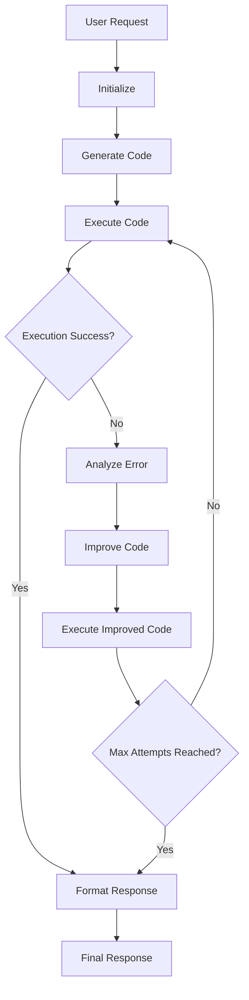

# Code Execution Flow

The Code Execution Flow provides intelligent code generation, execution, and automatic error correction capabilities for natural language programming tasks.

## Overview

The Code Execution Flow implements a sophisticated workflow that can:
- Generate code (Python, Bash, etc.) from natural language descriptions
- Execute code in isolated environments (Docker, local, Jupyter)
- Automatically analyze execution errors and improve code
- Provide iterative error correction with detailed improvement history

## Architecture



## Configuration

### Basic Configuration
```yaml
# Enable code execution flow
flows:
  code_execution:
    enabled: true
```

### Advanced Configuration
```yaml
# configs/statemachines/flows/code_execution.yaml
enabled: true

# Code generation settings
generation:
  model: "anthropic:claude-sonnet-4-0"
  temperature: 0.7
  max_tokens: 2000
  timeout: 60

# Execution settings
execution:
  use_docker: true
  use_jupyter: false
  timeout: 120
  max_retries: 3

# Error improvement settings
improvement:
  enabled: true
  max_attempts: 3
  model: "anthropic:claude-sonnet-4-0"
  focus: "fix_errors"  # fix_errors, optimize, robustness

# Response formatting
response:
  include_improvement_history: true
  show_performance_metrics: true
  format: "markdown"  # markdown, json, plain
```

## Usage Examples

### Basic Code Generation and Execution
```bash
uv run deepresearch \
  question="Write a Python function that calculates the fibonacci sequence"
```

### With Automatic Error Correction
```bash
uv run deepresearch \
  question="Create a script that processes CSV data and generates statistics" \
  flows.code_execution.improvement.enabled=true
```

### Multi-Language Support
```bash
uv run deepresearch \
  question="Create a bash script that monitors system resources" \
  flows.code_execution.generation.language=bash
```

### Advanced Configuration
```bash
uv run deepresearch \
  --config-name=code_execution_advanced \
  question="Implement a machine learning model for classification" \
  flows.code_execution.execution.use_docker=true \
  flows.code_execution.improvement.max_attempts=5
```

## Code Generation Capabilities

### Supported Languages
- **Python**: General-purpose programming, data analysis, ML/AI
- **Bash**: System administration, automation, file processing
- **Auto-detection**: Automatically determines appropriate language based on request

### Generation Features
- **Context-aware**: Considers request complexity and requirements
- **Best practices**: Includes error handling, documentation, and optimization
- **Modular design**: Creates reusable, well-structured code
- **Security considerations**: Avoids potentially harmful operations

## Execution Environments

### Docker Execution (Recommended)
- **Isolated environment**: Secure code execution in containers
- **Dependency management**: Automatic handling of required packages
- **Resource limits**: Configurable CPU, memory, and timeout limits
- **Multi-language support**: Consistent execution across languages

### Local Execution
- **Direct execution**: Run code directly on host system
- **Performance**: Lower overhead, faster execution
- **Dependencies**: Requires manual dependency management
- **Security**: Less isolated, potential system impact

### Jupyter Execution
- **Interactive environment**: Stateful code execution with persistence
- **Rich output**: Support for plots, images, and interactive content
- **Stateful computation**: Variables and results persist across executions
- **Rich media**: Support for HTML, LaTeX, and other rich content types

## Error Analysis and Improvement

### Automatic Error Detection
The system automatically detects and categorizes errors:

- **Syntax Errors**: Code parsing and structure issues
- **Runtime Errors**: Execution-time failures (undefined variables, type errors, etc.)
- **Logical Errors**: Incorrect algorithms or logic flow
- **Environment Errors**: Missing dependencies, permission issues, resource limits
- **Import Errors**: Missing modules or packages

### Intelligent Code Improvement
The Code Improvement Agent provides:

#### Error Analysis
- **Root Cause Identification**: Determines the underlying cause of failures
- **Impact Assessment**: Evaluates the severity and scope of the error
- **Recommendation Generation**: Provides specific steps for resolution

#### Code Enhancement
- **Error Fixes**: Corrects syntax, logical, and runtime errors
- **Robustness Improvements**: Adds error handling and validation
- **Performance Optimization**: Improves efficiency and resource usage
- **Best Practices**: Applies language-specific coding standards

#### Iterative Improvement
- **Multi-step Refinement**: Progressive improvement attempts
- **History Tracking**: Detailed record of all improvement attempts
- **Convergence Detection**: Stops when code executes successfully

## Response Formatting

### Success Response
```markdown
**✅ Execution Successful**

**Generated Python Code:**
```python
def fibonacci(n):
    """Calculate the nth Fibonacci number."""
    if n <= 1:
        return n
    return fibonacci(n-1) + fibonacci(n-2)

# Example usage
result = fibonacci(10)
print(f"Fibonacci(10) = {result}")
```

**Execution Result:**
```
Fibonacci(10) = 55
```

**Performance:**
- Generation: 2.34s
- Execution: 0.12s
- Total: 2.46s
```

### Error with Improvement Response
```markdown
**❌ Execution Failed**

**Error:** NameError: name 'undefined_variable' is not defined

**Error Type:** runtime
**Root Cause:** Undefined variable reference
**Improvement Attempts:** 1

**Improved Python Code:**
```python
def process_data(data):
    """Process input data and return statistics."""
    if not data:
        return {"error": "No data provided"}

    try:
        # Calculate basic statistics
        total = sum(data)
        count = len(data)
        average = total / count

        return {
            "total": total,
            "count": count,
            "average": average
        }
    except Exception as e:
        return {"error": f"Processing failed: {str(e)}"}

# Example usage with error handling
data = [1, 2, 3, 4, 5]
result = process_data(data)
print(f"Statistics: {result}")
```

**✅ Success after 1 iterations!**

**Execution Result:**
```
Statistics: {'total': 15, 'count': 5, 'average': 3.0}
```

**Improvement History:**
**Attempt 1:**
- **Error:** NameError: name 'undefined_variable' is not defined
- **Fix:** Added proper variable initialization, error handling, and documentation
```

## Advanced Features

### Custom Execution Environments
```python
from DeepResearch.src.utils.coding import DockerCommandLineCodeExecutor

# Custom Docker execution
executor = DockerCommandLineCodeExecutor(
    timeout=300,
    work_dir="/workspace",
    image="python:3.11-slim",
    auto_remove=True
)

result = await executor.execute_code_blocks([
    CodeBlock(code="pip install numpy pandas", language="bash"),
    CodeBlock(code="import numpy as np; print('NumPy version:', np.__version__)", language="python")
])
```

### Interactive Jupyter Sessions
```python
from DeepResearch.src.utils.jupyter import JupyterCodeExecutor

# Create Jupyter executor
executor = JupyterCodeExecutor(
    connection_info=JupyterConnectionInfo(
        host="localhost",
        port=8888,
        token="your-token"
    )
)

# Execute with state persistence
result = await executor.execute_code_blocks([
    CodeBlock(code="x = 42", language="python"),
    CodeBlock(code="y = x * 2; print(f'y = {y}')", language="python")
])
```

### Batch Processing
```python
from DeepResearch.src.agents.code_execution_orchestrator import CodeExecutionOrchestrator

orchestrator = CodeExecutionOrchestrator()

# Process multiple requests
requests = [
    "Calculate factorial using recursion",
    "Create a data visualization script",
    "Implement a sorting algorithm"
]

results = []
for request in requests:
    result = await orchestrator.process_request(
        request,
        enable_improvement=True,
        max_iterations=3
    )
    results.append(result)
```

## Integration with Other Flows

### With PRIME Flow
```bash
uv run deepresearch \
  flows.prime.enabled=true \
  flows.code_execution.enabled=true \
  question="Design a protein and generate the analysis code"
```

### With Bioinformatics Flow
```bash
uv run deepresearch \
  flows.bioinformatics.enabled=true \
  flows.code_execution.enabled=true \
  question="Analyze gene expression data and create visualization scripts"
```

### With DeepSearch Flow
```bash
uv run deepresearch \
  flows.deepsearch.enabled=true \
  flows.code_execution.enabled=true \
  question="Research machine learning algorithms and implement comparison scripts"
```

## Best Practices

### Code Generation
1. **Clear Specifications**: Provide detailed, unambiguous requirements
2. **Context Information**: Include relevant constraints and requirements
3. **Language Preferences**: Specify preferred programming language when needed
4. **Example Outputs**: Describe expected input/output formats

### Error Handling
1. **Enable Improvements**: Always enable automatic error correction
2. **Reasonable Limits**: Set appropriate maximum improvement attempts
3. **Review Results**: Examine improvement history for learning opportunities
4. **Iterative Refinement**: Use iterative improvement for complex tasks

### Execution Environment
1. **Docker First**: Prefer Docker execution for security and isolation
2. **Resource Planning**: Configure appropriate resource limits
3. **Dependency Management**: Handle required packages explicitly
4. **Timeout Settings**: Set reasonable execution timeouts

### Performance Optimization
1. **Caching**: Enable result caching for repeated operations
2. **Parallel Execution**: Use batch processing for multiple tasks
3. **Resource Monitoring**: Monitor execution time and resource usage
4. **Optimization**: Enable code optimization features

## Troubleshooting

### Common Issues

**Code Generation Failures:**
```bash
# Increase generation timeout and model temperature
flows.code_execution.generation.timeout=120
flows.code_execution.generation.temperature=0.8
```

**Execution Timeouts:**
```bash
# Increase execution timeout and resource limits
flows.code_execution.execution.timeout=300
flows.code_execution.execution.memory_limit=2g
```

**Improvement Loops:**
```bash
# Limit improvement attempts and enable debugging
flows.code_execution.improvement.max_attempts=2
flows.code_execution.improvement.debug=true
```

**Docker Issues:**
```bash
# Check Docker availability and use local execution as fallback
flows.code_execution.execution.use_docker=false
flows.code_execution.execution.local_fallback=true
```

### Debug Mode
```bash
# Enable detailed logging and debugging
uv run deepresearch \
  question="Debug this code generation" \
  hydra.verbose=true \
  flows.code_execution.improvement.debug=true \
  flows.code_execution.response.show_debug_info=true
```

## Performance Metrics

### Execution Statistics
- **Generation Time**: Time to generate initial code
- **Execution Time**: Time to execute generated code
- **Improvement Time**: Time spent on error analysis and code improvement
- **Total Time**: End-to-end processing time
- **Success Rate**: Percentage of successful executions
- **Improvement Efficiency**: Average improvements per attempt

### Quality Metrics
- **Code Quality Score**: Automated assessment of generated code
- **Error Reduction**: Percentage reduction in errors through improvement
- **Robustness Score**: Assessment of error handling and validation
- **Performance Score**: Execution efficiency and resource usage

## Security Considerations

### Code Execution Security
- **Container Isolation**: All code executes in isolated Docker containers
- **Resource Limits**: Configurable CPU, memory, and network restrictions
- **Permission Control**: Limited filesystem and network access
- **Command Filtering**: Blocking potentially harmful operations

### Input Validation
- **Code Analysis**: Static analysis of generated code for security issues
- **Dependency Scanning**: Checking for malicious or vulnerable packages
- **Sandboxing**: Additional security layers for sensitive operations

## Future Enhancements

### Planned Features
- **Multi-language Support**: Expanded language support (R, Julia, etc.)
- **Interactive Debugging**: Step-through debugging capabilities
- **Code Review Integration**: Automated code review and suggestions
- **Performance Profiling**: Detailed performance analysis and optimization
- **Collaborative Coding**: Multi-user code development and review

For more detailed API documentation, see the [Agents API](../../api/agents.md) and [Tools API](../../api/tools.md).
